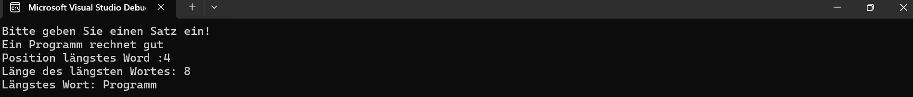

# Programm zur Zählung der Wörter und Finden des längsten Wortes

Dieses Programm zählt die Anzahl der Wörter in einem vom Benutzer eingegebenen Satz, findet das längste Wort und gibt die Anzahl der Buchstaben dieses Wortes aus.

## Verwendung

Der Benutzer wird aufgefordert, einen Satz einzugeben, und das Programm führt die folgenden Schritte durch:

1. Der Satz wird in Wörter aufgeteilt.
2. Die Gesamtanzahl der Wörter wird berechnet.
3. Das längste Wort und die Anzahl der Buchstaben dieses Wortes werden gefunden.

## Screenshot




## Beispielverwendung

Im Folgenden finden Sie ein Beispiel, wie das Programm ausgeführt wird:

```sh
Bitte geben Sie einen Satz ein:
Ihr Satz besteht aus 5 Wörtern.
Das längste Wort: Programm
Anzahl der Buchstaben des längsten Wortes: 7

