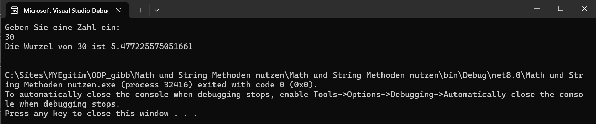
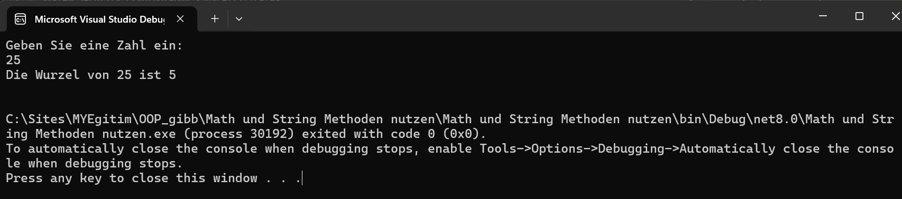

# Quadratwurzel Berechnung

Dieses Projekt ist ein einfaches C# Konsolenprogramm, das den Benutzer auffordert, eine Zahl einzugeben, und anschließend die Quadratwurzel dieser Zahl berechnet und anzeigt. Die Berechnung der Quadratwurzel erfolgt durch einen separaten Methodenaufruf.

## Funktionsweise

1. Der Benutzer wird aufgefordert, eine Zahl in die Konsole einzugeben.
2. Das Programm berechnet die Quadratwurzel der eingegebenen Zahl, indem es eine Methode verwendet.
3. Das Ergebnis wird in der Konsole angezeigt.

## Eigenschaften

- **Benutzerfreundlich**: Das Programm ist einfach und intuitiv zu bedienen.
- **Modularer Aufbau**: Die Berechnung der Quadratwurzel erfolgt in einer separaten Methode, was den Code sauber und übersichtlich hält.

## Verwendung

1. Das Programm in einer C#-Entwicklungsumgebung öffnen.
2. Das Projekt ausführen.
3. Eine Zahl in die Konsole eingeben.
4. Die berechnete Quadratwurzel wird direkt angezeigt.

## Screenshots

