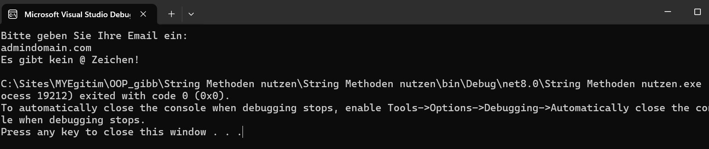
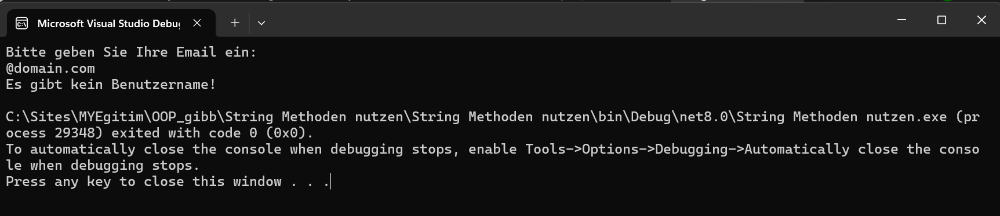
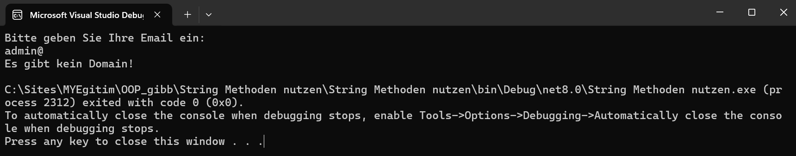
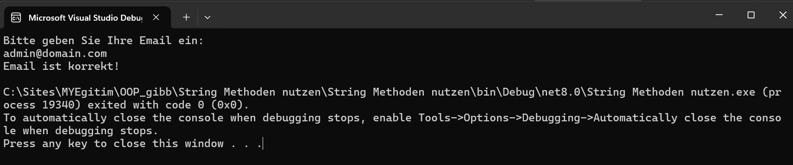

# E-Mail Validierung Programm

Dieses Programm überprüft, ob eine eingegebene Zeichenkette eine gültige E-Mail-Adresse ist. Es nutzt grundlegende String-Methoden, um verschiedene Fehlerzustände zu erkennen.

## Funktionalitäten

Das Programm behandelt die folgenden Fälle:

- **Kein `@` Zeichen:** Die eingegebene E-Mail-Adresse enthält kein `@` Zeichen.
- **Empfänger fehlt:** Die E-Mail-Adresse enthält ein `@`, aber der Empfängername fehlt.
- **Domain fehlt:** Die E-Mail-Adresse enthält ein `@`, aber der Domain-Name fehlt.
- **Domäne nicht korrekt:** Die E-Mail-Adresse enthält ein `@` und eine Domain, aber die Domain ist nicht korrekt (z.B. fehlt die Top-Level-Domain wie `.com`).
- **E-Mail korrekt:** Die E-Mail-Adresse entspricht dem Format `name.vorname@domain.com`.

## Verwendung

1. **Klonen Sie das Repository:**
    ```sh
    git clone https://github.com/benutzername/repositoryname.git
    cd repositoryname
    ```

2. **Projekt kompilieren:**
   Öffnen Sie die Lösung in Visual Studio oder verwenden Sie die .NET CLI:
    ```sh
    dotnet build
    ```

3. **Programm ausführen:**
   Führen Sie das Programm aus, um die Eingabe zu überprüfen:
    ```sh
    dotnet run
    ```

4. **Eingabe der E-Mail-Adresse:**
   Geben Sie eine E-Mail-Adresse ein, wenn das Programm dazu auffordert. Das Programm wird die Adresse überprüfen und entsprechende Fehlermeldungen ausgeben.

## Beispiel-Ausgaben

Hier sind einige Beispielausgaben des Programms:

- **Kein `@` Zeichen:**

    

- **Empfänger fehlt:**

    

- **Domain fehlt:**

    

- **Domäne nicht korrekt:**

    

- **E-Mail korrekt:**

    

